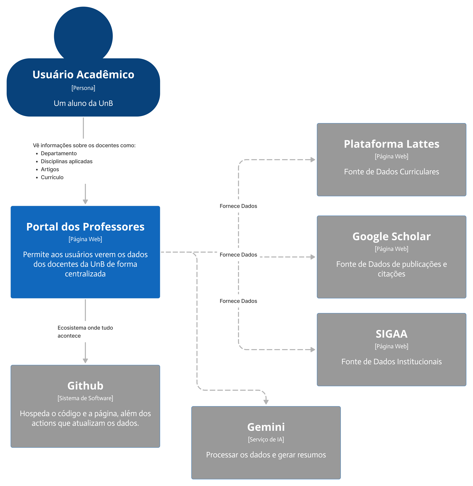

# Documento de Arquitetura - Portal de Professores da UnB

**Última atualização:** 29 de Setembro de 2025
**Versão:** 1.0

## 1. Visão Geral e Objetivos

Este documento detalha a arquitetura do "Portal de Professores", um projeto acadêmico cujo objetivo é centralizar e disponibilizar publicamente dados de professores da Universidade de Brasília (UnB) de forma organizada e acessível.

- **O Problema:** A dificuldade em encontrar informações consolidadas sobre o corpo docente, como departamento, áreas de atuação, publicações recentes e currículo Lattes.
- **A Solução:** Uma aplicação web que automatiza a coleta de dados de fontes públicas (Lattes, Google Scholar, SIGAA) via web scraping, enriquece esses dados com IA e os apresenta em uma interface moderna e interativa.
- **Público-alvo:** Alunos da UnB, pesquisadores e a comunidade acadêmica em geral.

## 2. Arquitetura de Alto Nível (C4 - Nível 1: Contexto)

A aplicação segue uma arquitetura desacoplada, interagindo com o usuário e diversos sistemas externos para coletar e apresentar os dados. O GitHub serve tanto como repositório de código quanto como plataforma de hospedagem e execução da coleta de dados.

## 3. Arquitetura de Containers (C4 - Nível 2: Containers)

O sistema "Portal dos Professores" é composto por quatro containers principais (no sentido C4 do termo), que funcionam de forma independente, mas coordenada.

### 3.1. Container: Aplicação Web (Frontend)

O ponto de entrada para o usuário. É uma Aplicação de Página Única (SPA) que oferece uma experiência de usuário rica e dinâmica.

- **Tecnologia:** React (com Vite).
- **Responsabilidades:**
    - Renderizar a interface do usuário.
    - Gerenciar a navegação entre páginas com **React Router**.
    - Consumir a API do Backend para buscar os dados dos professores.
    - **Hospedagem:** GitHub Pages.

### 3.2. Container: API (Backend)

O cérebro da aplicação, responsável por servir os dados de forma segura e estruturada para o Frontend.

- **Tecnologia:** FastAPI (Python).
- **Responsabilidades:**
    - Expor uma API RESTful com endpoints para consulta e filtro de professores.
    - Ler os dados do nosso armazenamento (Arquivo JSON).
    - Validar os dados de entrada e saída com **Pydantic**.
    - **Hospedagem:** Planejado para plataformas como Render.

### 3.3. Container: Armazenamento (Database)

A fonte única da verdade para a nossa aplicação.

- **Tecnologia:** Arquivo JSON (`professors.json`).
- **Responsabilidades:**
    - Armazenar de forma persistente todas as informações coletadas e processadas sobre os docentes.
    - Ser a fonte de dados para a API.

### 3.4. Container: Scripts de Coleta e Processamento

O pipeline de dados automatizado que alimenta nosso sistema. É executado de forma agendada.

- **Tecnologia:** Scripts Python.
- **Executor:** **GitHub Actions**, configurado para rodar periodicamente.
- **Responsabilidades:**
    - Orquestrar todo o processo de coleta e processamento.
    - Extrair dados brutos das fontes externas (Lattes, Scholar, SIGAA) usando **Playwright**.
    - Enriquecer os dados (ex: gerar resumos) utilizando a **API do Gemini**.
    - Processar, limpar e salvar os dados consolidados no Arquivo JSON.

## 4. Arquitetura de Componentes (C4 - Nível 3: Componentes)

Aqui, detalhamos os componentes internos do container de "Scripts de Coleta e Processamento", mostrando o fluxo de dados do pipeline.

- **Executor (GitHub Actions):** Inicia o processo através de um gatilho agendado (cron).
- **Orquestrador (`main.py`):** Script principal que gerencia o fluxo de execução, chamando os scrapers e processadores na ordem correta.
- **Scrapers:** Módulos especializados em extrair dados brutos de cada plataforma (Lattes, Google Scholar, SIGAA).
- **Processador de Dados e Agentes de IA:** Componente que recebe os dados brutos, os limpa, unifica e utiliza a API do Gemini para enriquecê-los.
- **Saída:** O resultado final é a escrita dos dados processados no arquivo `professors.json`.

## 5. Infraestrutura e Desenvolvimento

- **Containerização:** **Docker** é utilizado para criar ambientes de desenvolvimento consistentes.
- **Orquestração Local:** **Docker Compose** permite que os desenvolvedores subam todo o ambiente (Frontend + Backend) com um único comando (`docker-compose up`).

## 6. Decisões Arquiteturais Chave

- **Decisão:** Adotar uma arquitetura desacoplada (Frontend SPA + Backend API).
    - **Justificativa:** Flexibilidade para evoluir e fazer deploy das partes de forma independente. O frontend foca apenas em UI, enquanto o backend foca apenas em lógica e dados.

- **Decisão:** Utilizar FastAPI para o backend.
    - **Justificativa:** Alta performance, facilidade de uso com Python e geração automática de documentação da API, o que acelera o desenvolvimento do frontend.

- **Decisão:** Usar um arquivo JSON como banco de dados.
    - **Justificativa:** Simplicidade para a fase atual do projeto, alinhado com a natureza dos dados e os requisitos acadêmicos, evitando a complexidade de um banco de dados tradicional.

## 7. Estratégia de Deploy

O processo de publicação da aplicação (deploy) é desenhado para ser o mais automatizado possível, utilizando as ferramentas do próprio GitHub.

-   **Frontend (GitHub Pages):**
    -   **Gatilho:** O deploy é acionado automaticamente a cada `push` na branch `main`.
    -   **Processo:** Uma **GitHub Action** específica para o frontend irá executar o processo de build (`npm run build`), que gera os arquivos estáticos otimizados. Em seguida, esses arquivos são publicados no GitHub Pages, tornando o site acessível publicamente.

-   **Backend (Render):**
    -   **Gatilho:** O deploy será acionado por `push` na branch `main` (via conexão com o repositório GitHub) ou manualmente.
    -   **Processo:** A plataforma Render irá detectar o `Dockerfile` do backend, construir a imagem Docker e iniciar o container. A API ficará disponível em uma URL pública fornecida pela plataforma.

-   **Pipeline de Dados (GitHub Actions):**
    -   **Gatilho:** A execução dos scripts de coleta é agendada para rodar periodicamente (ex: uma vez por dia) através de um gatilho `cron` definido no workflow da Action.
    -   **Processo:** A Action executa os scripts que, ao final, fazem um `commit` e `push` do arquivo `professors.json` atualizado de volta para o repositório. O backend, ao ser reiniciado, passará a servir os novos dados.

    ## 8. Considerações de Segurança

Embora a aplicação lide primariamente com dados públicos, as seguintes medidas de segurança são consideradas:

-   **Comunicação:** A comunicação entre o cliente e o servidor em produção será feita exclusivamente via **HTTPS**, garantindo que os dados sejam criptografados durante o trânsito.
-   **API:** A API do backend é projetada para ser **read-only** (apenas leitura) para o público geral, não expondo endpoints que possam modificar os dados (como `POST`, `PUT`, `DELETE`).
-   **Gerenciamento de Segredos:** Chaves de API (como a da Gemini API) não são armazenadas diretamente no código. Elas são gerenciadas através de **GitHub Secrets** para uso nas Actions, e como variáveis de ambiente na plataforma de deploy (Render).
-   **Validação de Dados:** O Pydantic no backend atua como uma camada de proteção, garantindo que apenas dados no formato esperado sejam processados, prevenindo certos tipos de ataques de injeção.