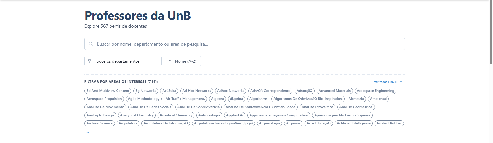
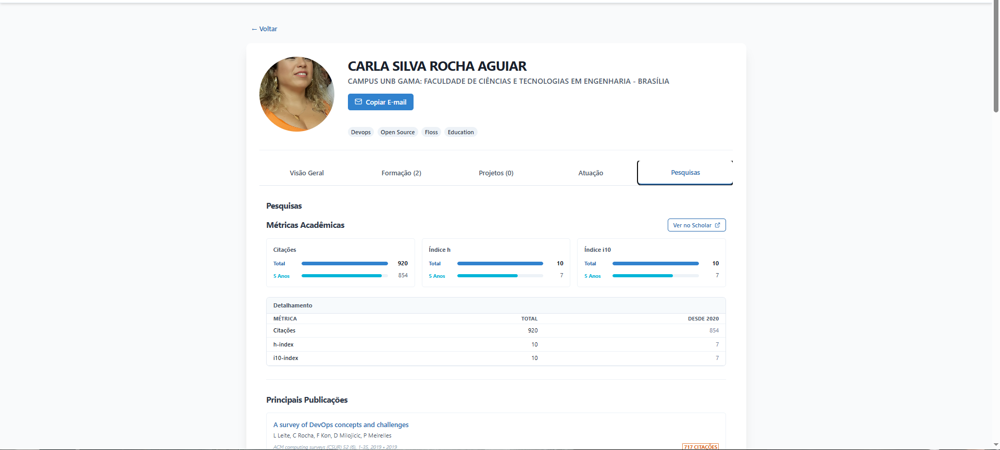
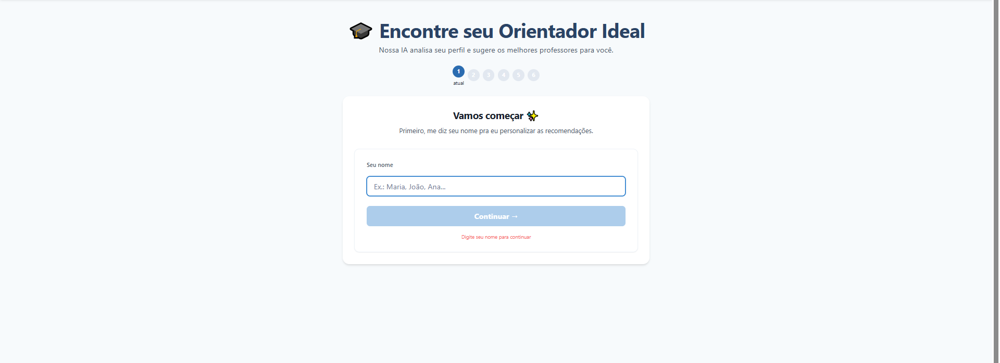

# 4. Desenvolvimento e Implementação

Este capítulo detalha as escolhas tecnológicas, a arquitetura do sistema e os processos de automação adotados para garantir a qualidade e a entrega contínua do **Hub Docente**.

## 4.1 Arquitetura da Solução

O sistema foi projetado seguindo uma arquitetura **Client-Server**. O Frontend (Single Page Application) consome dados e serviços através de uma API RESTful, garantindo a separação de responsabilidades entre a interface do usuário e a lógica de negócios, especialmente para o processamento do agente de IA.

### Tecnologias Utilizadas

A stack tecnológica foi selecionada visando a integração eficiente entre raspagem de dados, processamento de linguagem natural e uma interface reativa:

* **Frontend:**
    * **React + Vite:** Responsável pela interface do usuário. Consome os endpoints da API para exibir a lista de professores e a interface de chat.
    * **Hospedagem:** GitHub Pages.
* **Backend:**
    * **FastAPI:** Atua como o servidor central da aplicação. Ele expõe endpoints que servem os dados estruturados dos professores e gerencia as requisições para o agente de IA.
    * **Python (3.11):** Linguagem utilizada em todo o backend e scripts de automação.
    * **LangChain:** Framework integrado ao FastAPI para orquestrar o "Orientador Inteligente", processando o contexto do usuário e gerando recomendações.
* **Banco de Dados:**
    * **JSON (Flat-file):** A persistência de dados é feita em arquivos JSON (`professors.json`). O Backend lê esses arquivos e os serve via API, eliminando a complexidade de manutenção de um banco de dados relacional (SQL) para este escopo de dados semi-estáticos.
* **Web Scraping:**
    * **Playwright:** Utilizado para a mineração de dados (Data Mining) das fontes externas.

### Decisões Arquiteturais Importantes

**1. Estratégia Híbrida de Scraping (Local vs. CI)**

Um dos maiores desafios técnicos do projeto foi a extração de dados de plataformas com fortes mecanismos anti-bot, especificamente o **Google Scholar** e a plataforma **Lattes**.

* **O Problema:** Durante a execução em ambiente de Integração Contínua (GitHub Actions), o Google detecta o ambiente *headless* de servidores em nuvem e impõe bloqueios via reCAPTCHA impossíveis de serem transpostos de forma automatizada simples.
* **A Solução:** Adotamos uma estratégia híbrida:
    * **Scraper do SIGAA:** Roda de forma 100% automatizada e agendada via GitHub Actions, pois a plataforma é mais permissiva.
    * **Scraper Lattes/Scholar:** Projetado para rodar sob demanda em ambiente local. O desenvolvedor executa o script, resolve eventuais captchas manualmente se necessário, e commita o JSON atualizado. Isso garante a integridade dos dados sem violar as restrições dos provedores.

**2. Backend como Orquestrador de IA**
Optou-se por utilizar o **FastAPI** não apenas para servir dados, mas para sustentar o **LangChain**. Isso permite que a lógica pesada de processamento de linguagem natural fique no servidor, enquanto o Frontend permanece leve, apenas enviando os *prompts* do usuário e renderizando as respostas.

## 4.2 Implementação das Funcionalidades

O Hub Docente centraliza informações dispersas em uma interface única e intuitiva. Abaixo estão as principais funcionalidades entregues.

### 1. Busca Unificada e Filtragem
Permite que o aluno encontre professores utilizando filtros combinados: busca textual por nome, seleção por Departamento e Áreas de Interesse.

### 2. Página do Professor (Integração da Tríade)
A página de perfil consolida dados de três fontes distintas:
* **SIGAA:** Dados de contato e vínculo.
* **Lattes:** Formação acadêmica e áreas de atuação.
* **Google Scholar:** Métricas de impacto (Citações, H-Index) e grafo de publicações.

### 3. Orientador Inteligente (Agente de IA)
Integração de um agente baseado em LLM (via LangChain no Backend) que analisa as respostas do aluno e recomenda professores com base na compatibilidade de interesses de pesquisa.

## 4.3 Automação e DevOps

Utilizamos o **GitHub Actions** para garantir a integração contínua e a atualização dos dados. O projeto conta com três pipelines principais.

### Pipeline de Deploy (Frontend)
Responsável por construir e publicar a aplicação.
* **Gatilho:** Pushes na branch `main`.
* **Processo:**
    1.  Checkout do código.
    2.  Cópia dos dados (`professors.json`) para a pasta pública (para acesso estático de fallback ou assets).
    3.  Instalação de dependências e Build do React (Vite).
    4.  Upload e Deploy automático para o **GitHub Pages**.

### Pipeline de Dados (Scraper SIGAA)
Responsável por manter os dados institucionais atualizados.
* **Gatilho:** Agendamento (Cron) nos dias 1 e 15 de cada mês às 04:00h, ou execução manual.
* **Processo:**
    1.  Setup do Python e Playwright.
    2.  Execução do script `backend/scraper_runner.py --sigaa`.
    3.  Commit automático do arquivo `data/professors.json` atualizado de volta ao repositório.

### Pipeline de Qualidade (Testes)
Garante a integridade do código backend e gera métricas de qualidade.
* **Gatilho:** Pushes e Pull Requests na `main`.
* **Processo:**
    1.  Instalação das dependências.
    2.  Execução de testes automatizados com **Pytest**.
    3.  Verificação de cobertura de código (`pytest-cov`).
    4.  Geração e commit automático da *badge* de cobertura (`coverage.svg`) para exibição no README.