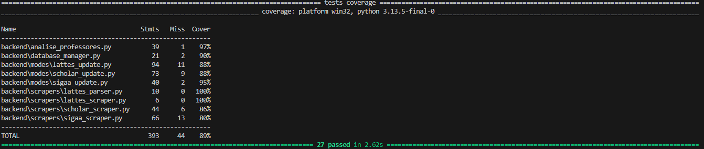

# 5. Testes e Qualidade

A garantia de qualidade do **Hub Docente** focou prioritariamente na integridade dos dados e na resiliência dos scrapers. Dada a natureza crítica da coleta de dados (Data Mining), a estratégia de testes priorizou o Backend e os scripts de automação.

## 5.1 Testes Unitários

Utilizamos o framework **Pytest** em conjunto com **Pytest-Asyncio** (para testes assíncronos) e **Pytest-Mock** (para isolamento de dependências).

A suíte de testes cobre aproximadamente **88%** do código do backend, garantindo que as lógicas de negócio e tratamento de exceções funcionem conforme o esperado.

### Estratégia de Mocking
Para evitar bloqueios de IP e garantir velocidade na execução, **não realizamos requisições HTTP reais** durante os testes unitários. Em vez disso, utilizamos `unittest.mock.MagicMock` e `AsyncMock` para simular:
1.  **Navegador (Playwright):** Simulamos a existência de elementos na página (ex: checkbox "Não sou robô") e comportamentos de erro (ex: Timeouts).
2.  **Sistema de Arquivos:** Simulamos a leitura e escrita de JSONs para não sujar o ambiente de desenvolvimento.

### Casos Principais Validados

Os testes foram divididos em módulos estratégicos:

* **Gerenciamento de Dados (`test_database_manager.py`):**
    * **Persistência:** Valida se dados escritos são recuperados identicamente ("Caminho Feliz").
    * **Resiliência:** Valida o comportamento do sistema ao encontrar arquivos corrompidos (`invalid.json`), arquivos inexistentes ou JSONs válidos sem as chaves esperadas.

* **Lógica de Atualização (`test_lattes_update.py`):**
    * **Modo Híbrido:** Testamos a lógica que decide quais professores devem ser atualizados. Validamos se a flag `missing_only=True` realmente dispara o scraper apenas para perfis incompletos.
    * **Concorrência:** Validação das rotinas `asyncio.gather` para garantir que o processamento em paralelo dos departamentos ocorra corretamente.

* **Scrapers e Resiliência (`test_lattes_scraper.py`):**
    * **Interação com DOM:** Testamos se o script identifica corretamente o botão de submissão e checkboxes de segurança.
    * **Mecanismo de Retry:** Simulamos falhas de rede (`TimeoutError`) para garantir que o scraper tente recarregar a página até 3 vezes antes de desistir ("Caminho Triste").

## 5.2 Testes de Integração

Embora não haja testes de ponta a ponta (E2E) no Frontend, realizamos testes de integração no nível de serviço do Backend para garantir que os módulos conversem entre si.

### Fluxos Testados

1.  **Fluxo Scraper -> Parser -> Database:**
    * Validamos se a saída bruta do HTML (mockada) é processada corretamente pelo parser (`parse_lattes_page`) e se o dicionário resultante é aceito pelo `DatabaseManager` para gravação.
    * Isso garante que uma mudança na estrutura do HTML ou no formato do JSON não quebre o pipeline de dados.

2.  **Critérios de Validação:**
    * Todo teste deve limpar seus artefatos (arquivos temporários) após a execução.
    * Nenhum teste deve depender de conexão externa à internet.
    * O tempo total de execução da suíte não deve ultrapassar 2 minutos.

*Nota: Testes de interface (Frontend) não foram implementados nesta versão, priorizando-se a robustez da camada de dados.*

## 5.3 Evidências

Abaixo apresentamos a estrutura organizacional dos testes e evidências de execução bem-sucedida.

### Estrutura de Testes
O projeto mantém uma estrutura espelhada, onde cada módulo do backend possui um arquivo de teste correspondente na pasta `tests/`.



### Relatório de Execução e Cobertura
Para reproduzir as evidências, utiliza-se o comando:
```bash
pytest --cov=backend