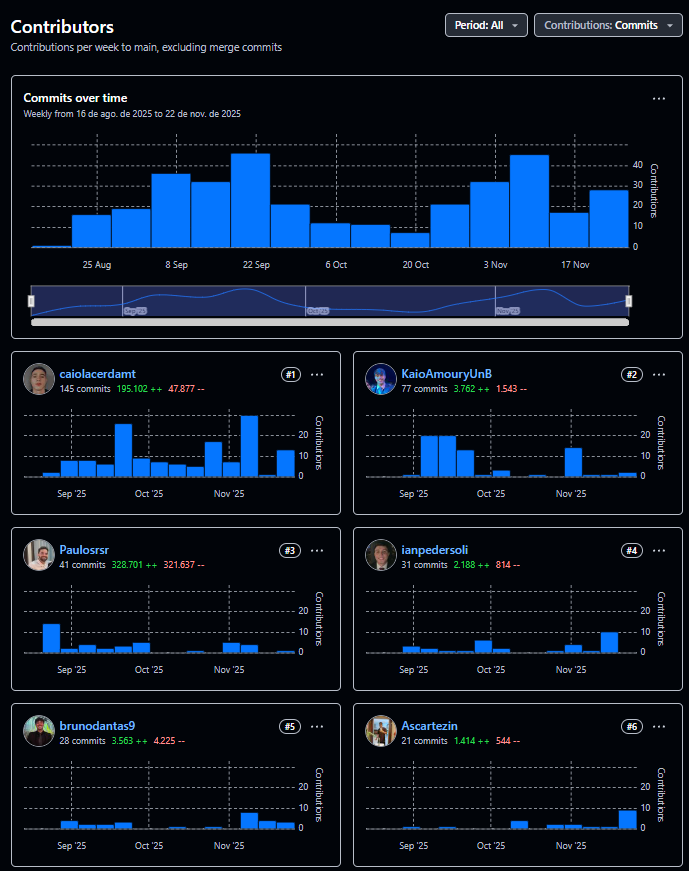

# Resultados e Entregas

Esta seção consolida os resultados obtidos com o desenvolvimento do **Hub Docente**, analisando as entregas, o cumprimento do escopo e a performance da equipe.

## 1. Resumo das Entregas

O projeto atingiu a etapa final com uma solução funcional que integra dados de três fontes distintas.

* **Frontend (SPA):** Interface desenvolvida em React, focada na usabilidade e na visualização clara dos dados dos professores.
* **Backend & Agente Inteligente:** API em FastAPI que gerencia a lógica de negócios e integra o modelo de IA para recomendações de orientadores.
* **Pipeline de Dados Híbrido:** Solução de *web scraping* que combina execução automática (SIGAA) com execução assistida (Lattes/Scholar) para contornar bloqueios de segurança.

## 1.1 Escopo: Planejado vs. Realizado

A equipe adotou a metodologia Scrum, o que permitiu adaptar o escopo ao longo das sprints. A principal alteração de escopo foi técnica, referente à automação total.

| Funcionalidade / Requisito | Status | Observação |
| :--- | :---: | :--- |
| **Busca e Filtros** | ✅ Concluído | Filtros por departamento, nome e área de atuação. |
| **Perfil Unificado** | ✅ Concluído | Agregação visual de dados do SIGAA, Lattes e Scholar. |
| **Agente de IA** | ✅ Concluído | Chatbot auxiliar para recomendação de orientadores. |
| **Automação 100% (CI/CD)** | 🔄 Adaptado | **Mudança Estratégica:** Planejamos rodar tudo via GitHub Actions. Porém, o *reCAPTCHA* do Google/Lattes bloqueia IPs de servidores em nuvem. **Solução:** Adotamos um modelo híbrido onde a extração complexa roda localmente e commita os dados. |
| **Login de Usuário** | ❌ Removido | Despriorizado para focar na qualidade e higienização dos dados públicos. |

---

# 2. Lições Aprendidas

O desenvolvimento do Hub Docente envolveu uma equipe de 6 integrantes com papéis definidos, mas colaborativos. Abaixo, destacamos os aprendizados técnicos e de processo.

## 2.1 O Desafio da Automação (Web Scraping)
A maior lição técnica do projeto foi lidar com **medidas anti-bot**. Aprendemos que:
1.  Serviços como Google Scholar possuem detecção agressiva de ambientes *headless* (sem interface gráfica), tornando inviável a automação pura em servidores de CI gratuitos (GitHub Actions).
2.  A solução requer intervenção humana eventual ou uso de proxies residenciais pagos (inviável para o orçamento do projeto acadêmico).
3.  **Resultado:** A arquitetura foi flexibilizada para aceitar "cargas de dados" manuais, garantindo a continuidade do projeto.

## 2.2 Experiência da Equipe

A divisão de tarefas permitiu que cada membro se especializasse, mantendo a responsabilidade compartilhada pela documentação.

* **Caio Lacerda (Backend & IA):** Aprofundou conhecimentos em arquitetura de dados e na complexidade de integrar LLMs (LangChain) com dados estruturados reais.
* **Ian Pedersoli (Fullstack):** Atuou na ponte entre o *core* da aplicação e a interface, garantindo que os dados complexos do backend fossem renderizados corretamente no React.
* **Arthur Scartezini (Prototipagem & Frontend):** Vivenciou o ciclo completo de transformar protótipos de alta fidelidade em componentes de código funcionais.
* **Kaio (Frontend & Gestão):** Focou na organização dos ritos do Scrum (atas e reuniões) e no desenvolvimento de interfaces, equilibrando código e processo.
* **Bruno & Paulo (Frontend):** Focaram na implementação da interface do usuário, garantindo a responsividade e a fidelidade visual do Hub.

---

# 3. Conclusão

O **Hub Docente** encerra seu ciclo de desenvolvimento acadêmico cumprindo seu objetivo principal: **centralizar a informação**. Onde antes um aluno precisava de 3 abas e buscas manuais, agora ele tem um perfil único e consolidado.

## 3.1 Relevância da Solução
O projeto provou ser tecnicamente viável e de alto valor para a comunidade acadêmica da UnB. A integração do Agente de IA demonstrou como tecnologias modernas podem facilitar processos burocráticos, como a escolha de um orientador.

## 3.2 Futuro do Projeto
Atualmente, a equipe avalia dois caminhos para a sustentabilidade da ferramenta:
1.  **Open Source:** Disponibilizar o repositório para que futuros alunos da disciplina de MDS possam evoluir a ferramenta (adicionando Login ou novos scrapers).
2.  **Adoção Institucional:** Apresentar a solução aos departamentos para avaliar o interesse em hospedar a ferramenta oficialmente.

---

# Anexos
 
Contribuidores:

## Links e Repositórios
* **Acesse o Site:** [Portal dos Professores](https://unb-mds.github.io/2025-2-Portal-dos-Professores)
* **Repositório:** [Repositório](https://github.com/unb-mds/2025-2-Portal-dos-Professores)
* **Figma:** [Figma](https://www.figma.com/design/bjxbjjiQO9wNsDTUrOxa95/MDS---SQUAD-4?node-id=1-696&t=39Fl2F6PiLNuY4Pd-0)
